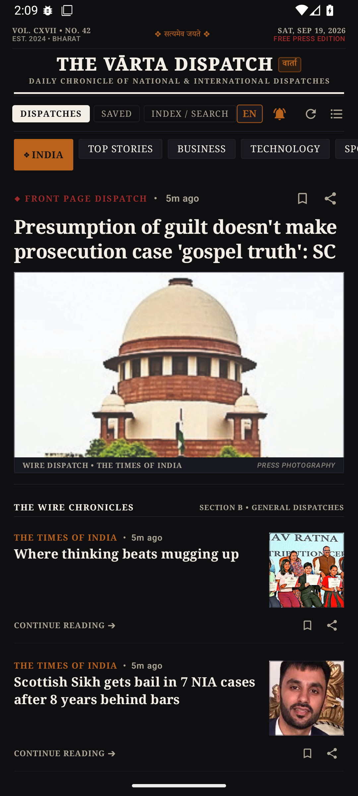
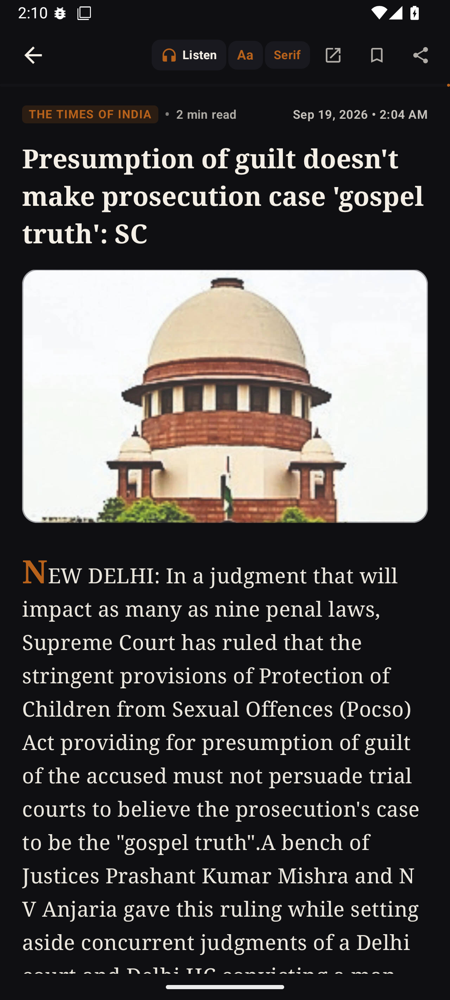
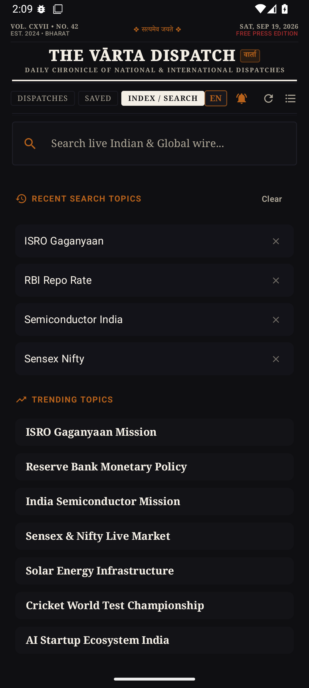
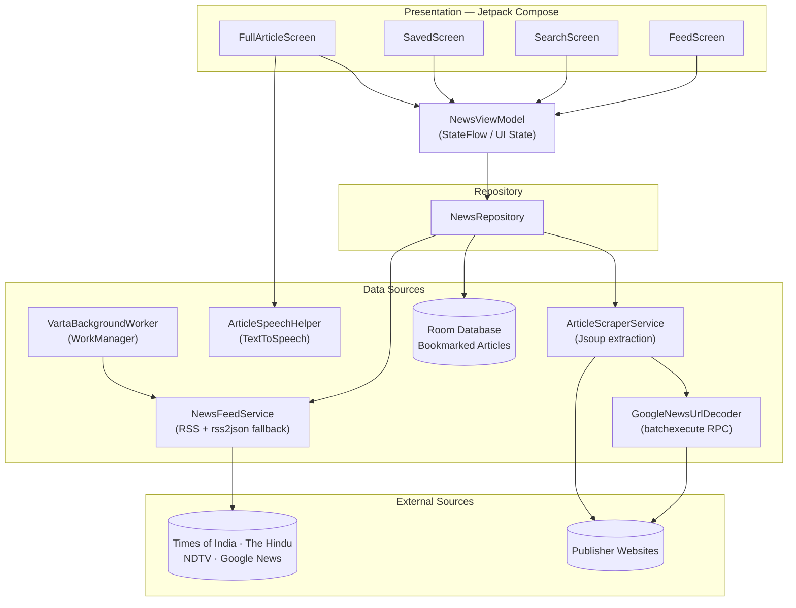

<div align="center">


# Vārta
### वार्ता — *The news, distilled.*

**A native Android news reader, reborn as an editorial product.**
Live multi-source RSS aggregation · full-article extraction · a distraction-free, newsprint-grade reading experience — plus a matching broadsheet-style companion website.

<br />

[](https://kotlinlang.org)
[](https://developer.android.com/jetpack/compose)
[](https://developer.android.com/tools/releases/platforms)
[](https://developer.android.com/tools/releases/platforms)
[](#license)

**[⬇ Download the APK](./varta.apk)** &nbsp;·&nbsp; **[🌐 Visit the website](#-companion-website)** &nbsp;·&nbsp; **[📱 Get Started](#-getting-started)**

</div>

<br />

## Table of Contents

- [Overview](#overview)
- [Features](#features)
- [Screenshots](#screenshots)
- [Tech Stack](#tech-stack)
- [Architecture](#architecture)
- [How It Works](#how-it-works)
- [News Categories](#news-categories)
- [Design Language](#design-language)
- [Companion Website](#-companion-website)
- [Download the APK](#-download-the-apk)
- [Getting Started](#getting-started)
- [Project Structure](#project-structure)
- [Roadmap](#roadmap)
- [Acknowledgments](#acknowledgments)
- [License](#license)

<br />

## Overview

**Vārta** (वार्ता — "discourse" or "news" in Sanskrit/Hindi) is a native Android news reader built end-to-end in **Jetpack Compose**. It pulls live headlines from multiple trusted Indian publishers in parallel, de-duplicates and merges them into a single resilient feed, then re-fetches and cleans the *full* article body — hero image, byline, publish date, and readable paragraphs — so you read a clean, ad-free, letterpress-style layout instead of a cluttered mobile website.

It isn't a thin wrapper around one API. It's a small, self-healing news pipeline: if a publisher's feed goes down, gets rate-limited, or throws up a bot-detection wall, Vārta silently falls back to the next source, a JSON proxy, or a clearly-labeled editorial summary — so the feed rarely feels empty, and a broken source never breaks the UI.

<br />

## Features

**📰 Reading experience**
- **Full article extraction** — scrapes and cleans the source publisher's page (hero image, byline, date, body copy) instead of a truncated RSS snippet
- **Two feed densities** — an immersive *Magazine* layout and a dense *Compact* list
- **Estimated read time** and auto-generated key highlights on every article
- **Listen to any article** — on-device text-to-speech reads the full piece aloud, with play / pause / resume and adjustable narration speed
- **In-reader typography controls** — three text sizes (Compact · Standard · Comfort) and a Serif/Sans font toggle, tuned live while you read
- **Save for later** — bookmark stories to a local, on-device Room library
- **Live search** across Google News' full index, not just cached categories
- **Native share sheet** integration for any article

**🔔 Notifications & freshness**
- **Breaking-news push notifications** — a periodic `WorkManager` background job checks Top Stories/India and notifies you of new breaking headlines, complete with a user-facing on/off toggle and a test-notification action
- **Live "new stories" banner** — foreground polling surfaces fresh headlines without yanking your scroll position

**🎨 Personalization**
- **Dark & light editorial themes** — two fully custom, non-default palettes ("Midnight Press" and "Newsprint"), not stock Material colors

**📡 Data & reliability**
- **Multi-source aggregation** — every category merges feeds from The Times of India, The Hindu, NDTV, and Google News, de-duplicated by normalized headline
- **Google News redirect decoding** — resolves obfuscated `news.google.com` article links back to the real publisher URL via Google's internal batch-execute endpoint
- **Bot-wall & WAF detection** — recognizes Cloudflare / PerimeterX / Akamai challenge pages and gracefully falls back instead of rendering garbage
- **Three-tier fallback chain** — direct RSS/XML → `rss2json` proxy → clean editorial fallback, so a single feed failure never breaks the feed
- **Room-backed local persistence** for your saved reading list

<br />

## Screenshots

<div align="center">

&nbsp;&nbsp;
&nbsp;&nbsp;


*Category feed · Full-article reader with Listen and Serif/Sans font controls · Search with recent & trending topics*

</div>

<br />

## Tech Stack

| Layer | Technology |
|---|---|
| **Language** | [Kotlin](https://kotlinlang.org) 2.2.10 |
| **UI Toolkit** | [Jetpack Compose](https://developer.android.com/jetpack/compose) + Material 3 |
| **Architecture** | MVVM — `ViewModel` + unidirectional `StateFlow` |
| **Networking** | [OkHttp](https://square.github.io/okhttp/), [Retrofit](https://square.github.io/retrofit/), custom RSS/XML parser |
| **HTML Parsing** | [Jsoup](https://jsoup.org/) — publisher page scraping & OpenGraph/JSON-LD extraction |
| **Local Storage** | [Room](https://developer.android.com/training/data-storage/room) — bookmarked article persistence |
| **JSON** | [Moshi](https://github.com/square/moshi) with KSP codegen |
| **Image Loading** | [Coil](https://coil-kt.github.io/coil/) |
| **Background Work** | [WorkManager](https://developer.android.com/topic/libraries/architecture/workmanager) — periodic breaking-news checks |
| **Speech** | Android `TextToSpeech` — on-device article read-aloud |
| **Async** | Kotlin Coroutines & `Flow` |
| **Cloud (scaffolded)** | Firebase (App Check, Auth, Firestore, AI SDK) — provisioned for future Gemini-powered features |
| **Build** | Gradle Kotlin DSL, AGP 9.1.1, KSP |

<br />

## Architecture

Vārta follows a straightforward, testable MVVM pipeline — a single `NewsViewModel` exposes state to Compose screens, backed by one repository that arbitrates between the network and the local cache.



<br />

## How It Works

1. **Fetch** — for the selected category, Vārta queries several publisher RSS feeds in parallel via OkHttp, stopping early once enough uniquely-illustrated stories are collected.
2. **Merge & de-duplicate** — headlines are normalized and de-duplicated across sources, then sorted by recency.
3. **Resolve** — when a headline links through `news.google.com`, the decoder replays Google's internal signed batch-execute call to recover the real publisher URL.
4. **Scrape** — on open, `ArticleScraperService` fetches the publisher page with a realistic browser fingerprint, parses OpenGraph/Twitter/JSON-LD metadata for the hero image, byline, and body, and strips boilerplate.
5. **Fall back gracefully** — if a fetch is blocked by a bot wall or fails outright, Vārta builds a clean, clearly-labeled editorial summary from the RSS description instead of showing an error screen.
6. **Stay fresh** — a foreground polling loop surfaces a non-intrusive "new stories" banner, while a background `WorkManager` job checks periodically and raises a system notification for genuinely new breaking stories.

<br />

## News Categories

| Category | हिंदी | Sources |
|---|---|---|
| Top Stories | प्रमुख समाचार | TOI, The Hindu, NDTV, Google News |
| India | भारत | TOI, The Hindu, NDTV, Google News |
| Business | व्यापार | TOI, The Hindu, NDTV Profit, Google News |
| Technology | प्रौद्योगिकी | TOI, Gadgets 360, The Hindu, Google News |
| Sports | खेल | TOI, The Hindu, NDTV Sports, Google News |
| Entertainment | मनोरंजन | NDTV Movies, TOI, The Hindu, Google News |
| Science | विज्ञान | The Hindu, Google News |
| Health | स्वास्थ्य | TOI, The Hindu, Google News |

Plus free-text **search** across Google News' full index.

<br />

## Design Language

Vārta is built as a genuine editorial product — a "letterpress" identity shared across the app and its companion website, not a default Material theme.

<table>
<tr>
<td valign="top" width="50%">

**🌙 Dark — "Midnight Press"**

| | Hex |
|---|---|
|  Midnight ink | `#0F0F12` |
|  Card | `#1F1F28` |
|  Newsprint ivory | `#F4EFE6` |
|  Saffron | `#DCA148` |
|  Press red | `#D94848` |

</td>
<td valign="top" width="50%">

**☀️ Light — "Newsprint"**

| | Hex |
|---|---|
|  Parchment | `#F7F4EC` |
|  Card | `#EFE9DD` |
|  Letterpress ink | `#131211` |
|  Ochre | `#B8621B` |
|  Vermilion | `#9E2A2B` |

</td>
</tr>
</table>

Typography pairs a **serif** display face for headlines and body copy with a **sans-serif** for labels, tabs, and metadata — a deliberate nod to print-newspaper hierarchy. In-app, readers can toggle between Serif and Sans and step through three text sizes; the companion website layers on **Playfair Display**, **Merriweather**, and **Rozha One** (Devanagari) alongside **Inter** for a true broadsheet feel.

<br />

## 🌐 Companion Website

**THE VĀRTA DISPATCH** is a static, broadsheet-styled web edition of Vārta — same masthead, same dual light/dark "Newsprint ⇄ Midnight Press" palette, built with plain HTML/CSS/JS in [`website/`](./website).

**Live site:** `\_\_\_\_\_\_\_\_\_\_\_\_\_\_\_\_\_\_\_\_\_\_\_\_\_\_\_\_\_\_\_\_\_\_` <!-- add your deployed website URL here -->

To run it locally, just open [`website/index.html`](./website/index.html) in a browser, or serve the folder with any static host (GitHub Pages, Netlify, Vercel).

<br />

## 📥 Download the APK

A signed, ready-to-install build ships in the repo for quick sideloading — no build step required:

| | |
|---|---|
| **App APK** | [`varta.apk`](./varta.apk) |
| **Website mirror** | [`website/varta.apk`](./website/varta.apk) |

Enable **Install from unknown sources** on your Android device, transfer the APK, and tap to install. Requires **Android 6.0 (API 23)** or higher.

<br />

## Getting Started

### Prerequisites

- [Android Studio](https://developer.android.com/studio) (Ladybug or newer recommended)
- JDK 11+
- An Android device or emulator running **API 23 (Android 6.0)** or higher

### Clone & Open

```bash
git clone https://github.com/rw8165939-sketch/V-rta.git
cd V-rta
```

Open the folder in Android Studio and let Gradle sync — all dependencies are pinned in `gradle/libs.versions.toml`.

### Optional: Gemini API Key

Firebase AI is provisioned in the build but not yet wired into any feature. If you plan to build on it:

```bash
cp .env.example .env
# then uncomment and fill in:
# GEMINI_API_KEY=your_key_here
```

### Build & Run

```bash
./gradlew installDebug
```

Or press **Run ▶** in Android Studio with a connected device/emulator selected.

<br />

## Project Structure

```
V-rta/
├── app/
│   └── src/main/java/com/example/
│       ├── MainActivity.kt
│       ├── VartaApp.kt
│       ├── data/
│       │   ├── NewsRepository.kt
│       │   └── local/                      # Room database, DAO, entities
│       ├── model/                          # NewsArticle, NewsCategory, ScrapedArticle…
│       ├── network/
│       │   ├── NewsFeedService.kt          # RSS + JSON proxy fetching
│       │   ├── ArticleScraperService.kt    # Full-article extraction
│       │   ├── GoogleNewsUrlDecoder.kt     # Redirect resolution
│       │   └── RssFeedParser.kt
│       ├── ui/
│       │   ├── NewsViewModel.kt
│       │   ├── VartaAppScreen.kt
│       │   ├── components/                 # Story cards, preview sheet, notification dialog, skeletons
│       │   ├── screens/                    # Feed, Search, Saved, Full Article
│       │   └── theme/                      # Color, Type, Theme
│       ├── util/                           # Date, image, TTS, notification helpers
│       └── worker/
│           └── VartaBackgroundWorker.kt    # Periodic breaking-news check
├── website/                                # Static broadsheet-style companion web edition
│   ├── index.html
│   ├── styles.css
│   ├── app.js
│   └── varta.apk
├── build.gradle.kts
├── settings.gradle.kts
└── varta.apk
```

<br />

## Roadmap

Ideas for future iterations:

- [ ] Home-screen widget with top headlines
- [ ] Offline caching of full article bodies (not just bookmark metadata)
- [ ] Gemini-powered summarization, using the already-provisioned Firebase AI setup
- [ ] Additional regional-language sources
- [ ] Deploy and link the companion website publicly

<br />

## Acknowledgments

Vārta aggregates public RSS feeds from **The Times of India**, **The Hindu**, **NDTV**, and **Google News**, and is built on the shoulders of [Jetpack Compose](https://developer.android.com/jetpack/compose), [Jsoup](https://jsoup.org/), [Retrofit](https://square.github.io/retrofit/), [OkHttp](https://square.github.io/okhttp/), [Coil](https://coil-kt.github.io/coil/), [Moshi](https://github.com/square/moshi), and [Room](https://developer.android.com/training/data-storage/room). All trademarks and article content belong to their respective publishers — Vārta only links to and republishes freely available RSS summaries for personal reading convenience.

<br />

## License

No license file is currently included in this repository, which by default means all rights are reserved. If you intend to share or open-source this project, add a `LICENSE` file (e.g. [MIT](https://choosealicense.com/licenses/mit/) is a common permissive choice for personal Android projects).

<br />

<div align="center">

Built by [**Adarsh**](https://github.com/rw8165939-sketch)

</div>
