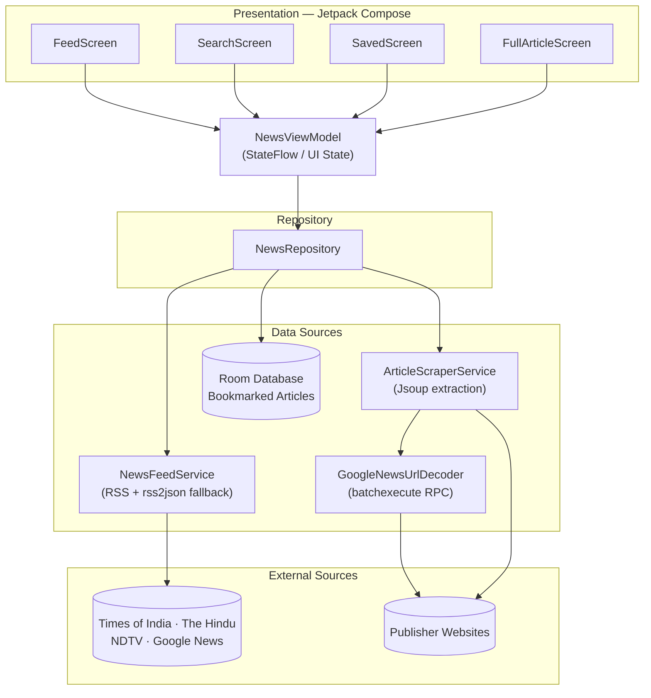

<div align="center">


# Vārta

### *The news, distilled.*

An ultra-premium, editorial-style Indian news reader for Android — live multi-source RSS aggregation, full article extraction, and a distraction-free reading experience wrapped in a dark-luxury, magazine-grade interface.

[](https://kotlinlang.org)
[](https://developer.android.com/jetpack/compose)
[](https://developer.android.com/tools/releases/platforms)
[](https://developer.android.com/tools/releases/platforms)
[](#license)

<br />


</div>

<br />

## Table of Contents

- [Overview](#overview)
- [Features](#features)
- [Screenshots](#screenshots)
- [Tech Stack](#tech-stack)
- [Architecture](#architecture)
- [How It Works](#how-it-works)
- [News Categories](#news-categories)
- [Design Language](#design-language)
- [Getting Started](#getting-started)
- [Project Structure](#project-structure)
- [Roadmap](#roadmap)
- [Acknowledgments](#acknowledgments)
- [License](#license)

<br />

## Overview

**Vārta** (वार्ता — "discourse" or "news" in Sanskrit/Hindi) is a native Android news reader built entirely with **Jetpack Compose**. It pulls live headlines from multiple trusted Indian publishers in parallel, de-duplicates and merges them into a single resilient feed, then re-fetches and cleans the *full* article body — hero image, author, publish date, and readable paragraphs — so you read a clean, ad-free, editorial layout instead of a cluttered mobile website.

It isn't a wrapper around a single API. It's a small, self-healing news pipeline: if one publisher's feed goes down, is rate-limited, or throws up a bot-detection wall, Vārta silently falls back to the next source, a JSON proxy, or a generated editorial summary — so the feed rarely feels empty.

<br />

## Features

**Reading experience**
- 🗞️ **Full article extraction** — scrapes and cleans the source publisher's page (hero image, byline, date, body copy) instead of showing a truncated RSS snippet
- 📖 **Two reading densities** — toggle between an immersive *Magazine* layout and a dense *Compact* list
- ⏱️ **Estimated read time** and **auto-generated key highlights** on every article
- 🌗 **Dark-luxury & warm-light themes**, both custom-built editorial palettes (not default Material colors)
- 🔖 **Save for later** — bookmark stories to a local on-device library you can revisit anytime
- 🔍 **Live search** across Google News' full index, not just cached categories
- 📤 **Native share sheet** integration for any article

**Data & reliability**
- 📡 **Multi-source aggregation** — every category merges feeds from The Times of India, The Hindu, NDTV, and Google News, de-duplicated by normalized headline
- 🧭 **Google News redirect decoding** — resolves obfuscated `news.google.com` article links back to the real publisher URL via Google's internal batch-execute endpoint
- 🛡️ **Bot-wall & WAF detection** — recognizes Cloudflare/PerimeterX/Akamai challenge pages and gracefully falls back instead of rendering garbage
- 🔁 **Three-tier fallback chain** — direct RSS/XML → JSON proxy → clean editorial fallback, so a feed failure never breaks the UI
- 🆕 **Live "new stories" banner** — background polling surfaces fresh headlines without yanking your scroll position
- 💾 **Room-backed local persistence** for your saved reading list

<br />

## Screenshots

<div align="center">
<!--
  Add screenshots or a screen-recording GIF here once available, e.g.:

  
  
  
-->
<i>Screenshots coming soon — capture the Feed, Full Article, Search, and Saved screens in both themes to showcase the editorial UI here.</i>
</div>

<br />

## Tech Stack

| Layer | Technology |
|---|---|
| **Language** | [Kotlin](https://kotlinlang.org) 2.2.10 |
| **UI Toolkit** | [Jetpack Compose](https://developer.android.com/jetpack/compose) + Material 3 |
| **Architecture** | MVVM — `ViewModel` + unidirectional `StateFlow` |
| **Networking** | [OkHttp](https://square.github.io/okhttp/), [Retrofit](https://square.github.io/retrofit/), custom RSS/XML parser |
| **HTML Parsing** | [Jsoup](https://jsoup.org/) — publisher page scraping & hero-image/JSON-LD extraction |
| **Local Storage** | [Room](https://developer.android.com/training/data-storage/room) — bookmarked article persistence |
| **JSON** | [Moshi](https://github.com/square/moshi) with KSP codegen |
| **Image Loading** | [Coil](https://coil-kt.github.io/coil/) |
| **Async** | Kotlin Coroutines & `Flow` |
| **Cloud (scaffolded)** | Firebase (App Check, AI SDK) — provisioned for future Gemini-powered features |
| **Build** | Gradle Kotlin DSL, AGP 9.1.1, KSP |

<br />

## Architecture

Vārta follows a straightforward, testable MVVM pipeline — a single `NewsViewModel` exposes state to Compose screens, backed by one repository that arbitrates between the network and the local cache.



<br />

## How It Works

1. **Fetch** — for the selected category, Vārta queries several publisher RSS feeds in parallel via OkHttp, stopping early once enough uniquely-illustrated stories are collected.
2. **Merge & de-duplicate** — headlines are normalized and de-duplicated across sources, then sorted by recency.
3. **Resolve** — when a headline links through `news.google.com`, the decoder replays Google's internal signed batch-execute call to recover the real publisher URL.
4. **Scrape** — on open, `ArticleScraperService` fetches the publisher page with a realistic browser fingerprint, parses OpenGraph/Twitter/JSON-LD metadata for the hero image, byline, and body, and strips boilerplate.
5. **Fall back gracefully** — if a fetch is blocked by a bot wall or fails outright, Vārta builds a clean, clearly-labeled editorial summary from the RSS description instead of showing an error screen.
6. **Stay fresh** — a background loop checks for new stories every few minutes and surfaces a non-intrusive "new stories" banner rather than auto-scrolling you away from what you're reading.

<br />

## News Categories

| Category | हिंदी | Sources |
|---|---|---|
| Top Stories | प्रमुख समाचार | TOI, The Hindu, NDTV, Google News |
| India | भारत | TOI, The Hindu, NDTV, Google News |
| Business | व्यापार | TOI, The Hindu, NDTV Profit, Google News |
| Technology | प्रौद्योगिकी | TOI, Gadgets 360, The Hindu, Google News |
| Sports | खेल | TOI, The Hindu, NDTV Sports, Google News |
| Entertainment | मनोरंजन | NDTV Movies, TOI, The Hindu, Google News |
| Science | विज्ञान | The Hindu, Google News |
| Health | स्वास्थ्य | TOI, The Hindu, Google News |

Plus free-text **search** across Google News' full index.

<br />

## Design Language

Vārta's UI is built as a genuine editorial product — serif display type for headlines, sans-serif for UI chrome, and two fully custom, non-default Material palettes.

<table>
<tr>
<td valign="top" width="50%">

**Dark — "Editorial Luxury"**

| | Hex |
|---|---|
|  Charcoal | `#0B0B0C` |
|  Card | `#19191E` |
|  Ivory | `#F5F1E8` |
|  Saffron | `#C9862E` |

</td>
<td valign="top" width="50%">

**Light — "Warm Editorial"**

| | Hex |
|---|---|
|  Cream | `#FAF7F0` |
|  Card | `#F3EFE6` |
|  Ink | `#121214` |
|  Saffron Deep | `#B57321` |

</td>
</tr>
</table>

Typography pairs a **serif display face** for headlines and body copy with a **sans-serif** for labels, tabs, and metadata — a deliberate nod to print newspaper hierarchy.

<br />

## Getting Started

### Prerequisites

- [Android Studio](https://developer.android.com/studio) (Ladybug or newer recommended)
- JDK 11+
- An Android device or emulator running **API 24 (Android 7.0)** or higher

### Clone & Open

```bash
git clone https://github.com/rw8165939-sketch/V-rta.git
cd V-rta
```

Open the folder in Android Studio and let Gradle sync — all dependencies are pinned in `gradle/libs.versions.toml`.

### Optional: Gemini API Key

Firebase AI is provisioned in the build but not yet wired into any feature. If you plan to build on it:

```bash
cp .env.example .env
# then uncomment and fill in:
# GEMINI_API_KEY=your_key_here
```

### Build & Run

```bash
./gradlew installDebug
```

Or press **Run ▶** in Android Studio with a connected device/emulator selected.

### Try the prebuilt APK

A release build (`varta.apk`) is included at the repo root for quick sideloading — enable *Install from unknown sources* on your device to try it without building from source.

<br />

## Project Structure

```
V-rta/
├── app/
│   └── src/main/java/com/example/
│       ├── MainActivity.kt
│       ├── VartaApp.kt
│       ├── data/
│       │   ├── NewsRepository.kt
│       │   └── local/              # Room database, DAO, entities
│       ├── model/                  # NewsArticle, NewsCategory, ScrapedArticle…
│       ├── network/
│       │   ├── NewsFeedService.kt          # RSS + JSON proxy fetching
│       │   ├── ArticleScraperService.kt    # Full-article extraction
│       │   ├── GoogleNewsUrlDecoder.kt     # Redirect resolution
│       │   └── RssFeedParser.kt
│       ├── ui/
│       │   ├── NewsViewModel.kt
│       │   ├── VartaAppScreen.kt
│       │   ├── components/         # Story cards, masthead, skeleton loaders
│       │   ├── screens/            # Feed, Search, Saved, Full Article
│       │   └── theme/              # Color, Type, Theme
│       └── util/                   # Date, image, and text helpers
├── build.gradle.kts
├── settings.gradle.kts
└── varta.apk
```

<br />

## Roadmap

Ideas for future iterations:

- [ ] Push notifications for breaking stories
- [ ] Home-screen widget with top headlines
- [ ] Offline caching of full article bodies (not just bookmarks metadata)
- [ ] Gemini-powered summarization, using the already-provisioned Firebase AI setup
- [ ] Additional regional-language sources

<br />

## Acknowledgments

Vārta aggregates public RSS feeds from **The Times of India**, **The Hindu**, **NDTV**, and **Google News**, and is built on the shoulders of [Jetpack Compose](https://developer.android.com/jetpack/compose), [Jsoup](https://jsoup.org/), [Retrofit](https://square.github.io/retrofit/), [OkHttp](https://square.github.io/okhttp/), [Coil](https://coil-kt.github.io/coil/), [Moshi](https://github.com/square/moshi), and [Room](https://developer.android.com/training/data-storage/room). All trademarks and article content belong to their respective publishers — Vārta only links to and republishes freely available RSS summaries for personal reading convenience.

<br />

## License

No license file is currently included in this repository, which by default means all rights are reserved. If you intend to share or open-source this project, add a `LICENSE` file (e.g. [MIT](https://choosealicense.com/licenses/mit/) is a common permissive choice for personal Android projects).

<br />

<div align="center">

Built by [**Adarsh**](https://github.com/rw8165939-sketch)

</div>
